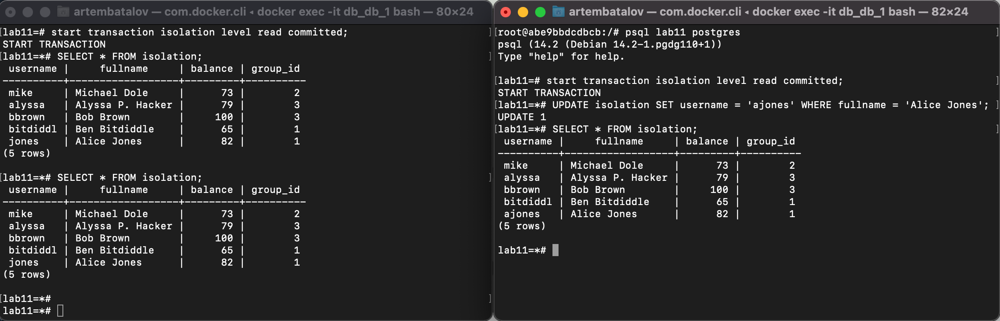

# Read commited
## Steps 1-4

Here we can see, second transaction changes its copy of db, so first cannot see these changes. 

## Steps 5-8

Both updates finised successfully (bit sencod transatcion waits the first). That is because second transation apply UPDATE operation to the updated (by 1st transation) version of table. This happens in accordance to [PostgreSQL docs](https://www.postgresql.org/docs/current/transaction-iso.html#XACT-READ-COMMITTED):
> <...> row might have already been updated (or deleted or locked) by another concurrent transaction by the time it is found. In this case, the would-be updater will wait for the first updating transaction to commit or roll back (if it is still in progress). <...> If the first updater commits, the second updater will ignore the row if the first updater deleted it, otherwise it will attempt to apply its operation to the updated version of the row.

# Repeatable read
## Steps 1-4
Here we can see the same situation as in `Read commited` level, because in both levels ([PostgreSQL docs](https://www.postgresql.org/docs/current/transaction-iso.html)):
> never sees either uncommitted data or changes committed during transaction execution by concurrent transactions

## Steps 5-8

(I mtakenly made 8th steps before 7th, but it has no matter for explanation)

Here we can see the interesting situation. After first query, second returned error.
According to [docs](https://www.postgresql.org/docs/current/transaction-iso.html#XACT-REPEATABLE-READ) it is correct behaviour:
> But if the first updater commits (and actually updated or deleted the row, not just locked it) then the repeatable read transaction will be rolled back with the message
>
> ERROR:  could not serialize access due to concurrent update
