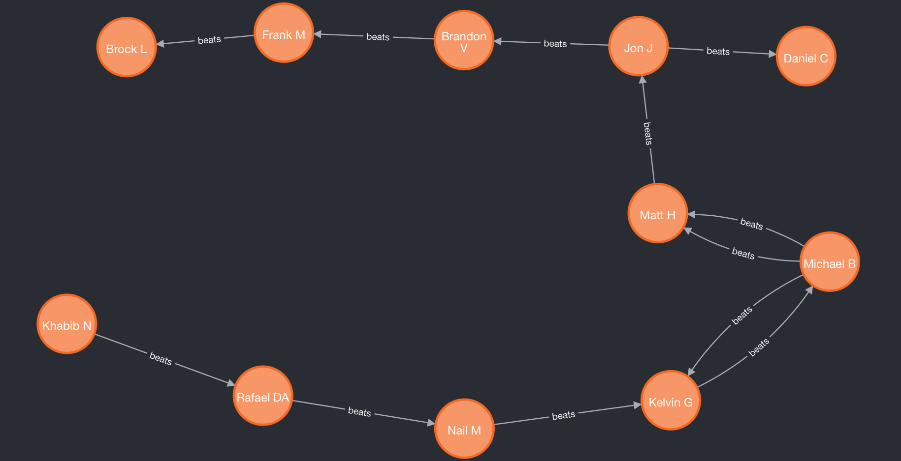
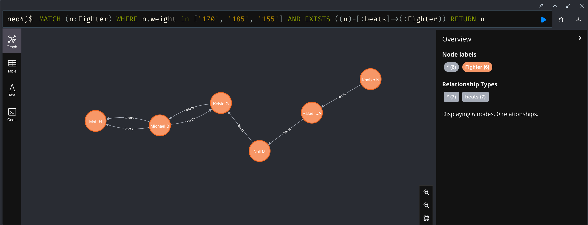
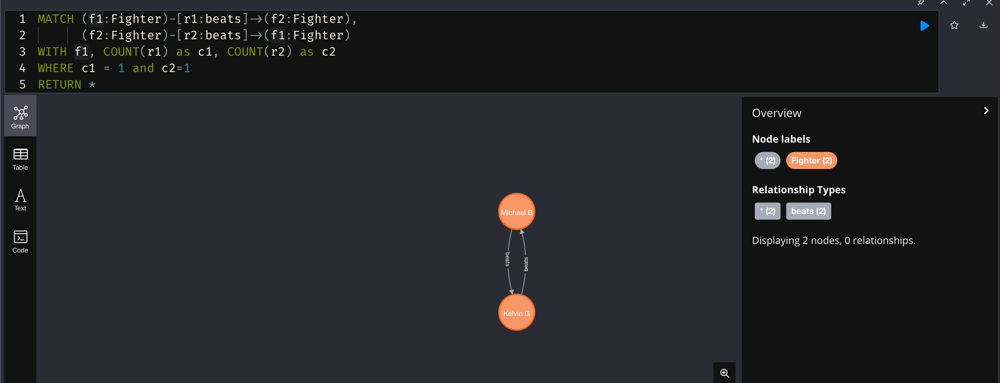
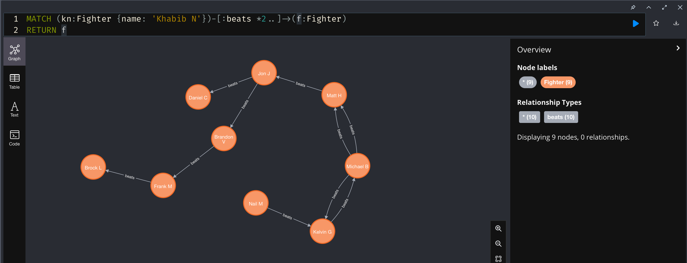
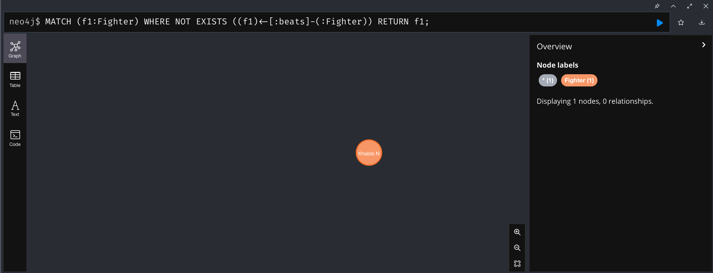
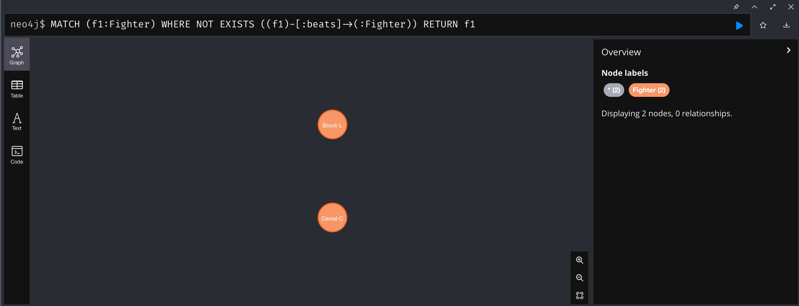

# Create DB
```
CREATE
(k:Fighter {name: 'Khabib N',weight:'155'}), 
(r:Fighter {name: 'Rafael DA',weight:'155'}),
(k)-[:beats]->(r),
(n:Fighter {name: 'Nail M',weight:'170'}),
(r)-[:beats]->(n),
(j:Fighter {name: 'Jon J',weight:'205'}),
(d:Fighter {name: 'Daniel C',weight:'205'}),
(j)-[:beats]->(d),
(mi:Fighter {name: 'Michael B',weight:'185'}),
(ma:Fighter {name: 'Matt H',weight:'185'}),
(mi)-[:beats]->(ma),
(bv:Fighter {name: 'Brandon V',weight:'205'}),
(j)-[:beats]->(bv),
(fm:Fighter {name: 'Frank M',weight:'230'}),
(bv)-[:beats]->(fm),
(bl:Fighter {name: 'Brock L',weight:'230'}),
(fm)-[:beats]->(bl),
(kg:Fighter {name: 'Kelvin G',weight:'230'}),
(n)-[:beats]->(kg),
(kg)-[:beats]->(mi),
(mi)-[:beats]->(ma),
(mi)-[:beats]->(kg),
(ma)-[:beats]->(j)
```


# 1
```
MATCH (n:Fighter) WHERE n.weight in ['170', '185', '155'] AND EXISTS ((n)-[:beats]->(:Fighter)) RETURN n
```


# 2
```
MATCH (f1:Fighter)-[r1:beats]->(f2:Fighter),
      (f2:Fighter)-[r2:beats]->(f1:Fighter)
WITH f1, COUNT(r1) as c1, COUNT(r2) as c2
WHERE c1 = 1 and c2=1
RETURN *
```


# 3
```
MATCH (kn:Fighter {name: 'Khabib N'})-[:beats *2..]->(f:Fighter)
RETURN f
```


# 4.1
```
MATCH (f1:Fighter) WHERE NOT EXISTS ((f1)<-[:beats]-(:Fighter))
RETURN f1
```


# 4.2
```
MATCH (f1:Fighter) WHERE NOT EXISTS ((f1)-[:beats]->(:Fighter))
RETURN f1
```


# 5
```
MATCH (f:Fighter), (f)-[r1:beats]->(:Fighter)
WITH f, COUNT(r1) as n_wins
SET f.n_wins = n_wins;

MATCH (f:Fighter), (f)<-[r1:beats]-(:Fighter)
WITH f, COUNT(r1) as n_defeats
SET f.n_defeats = n_defeats;
```
